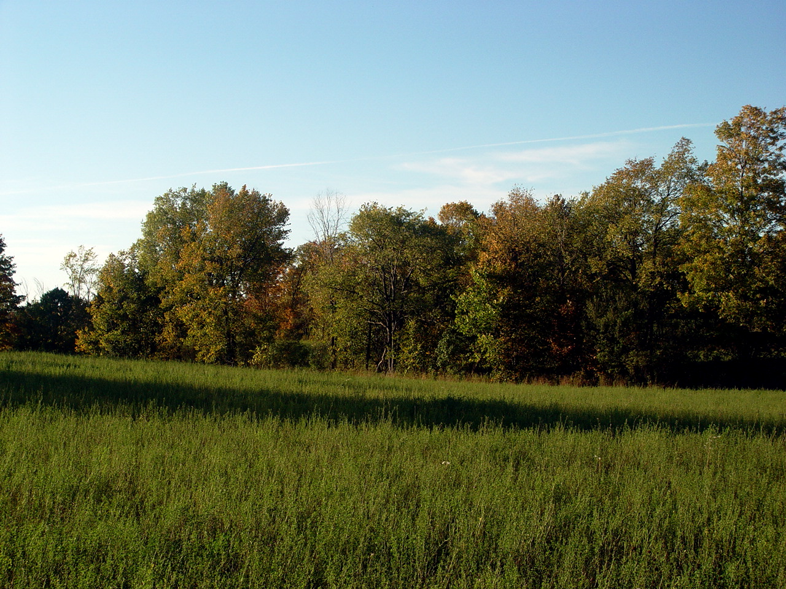
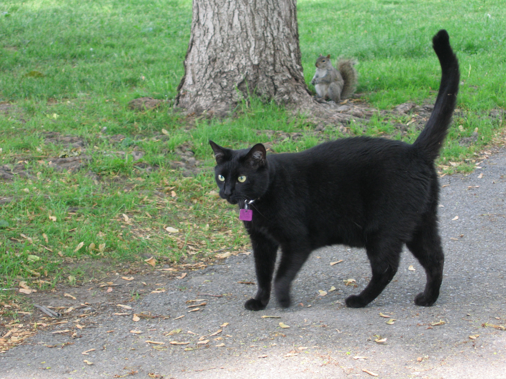
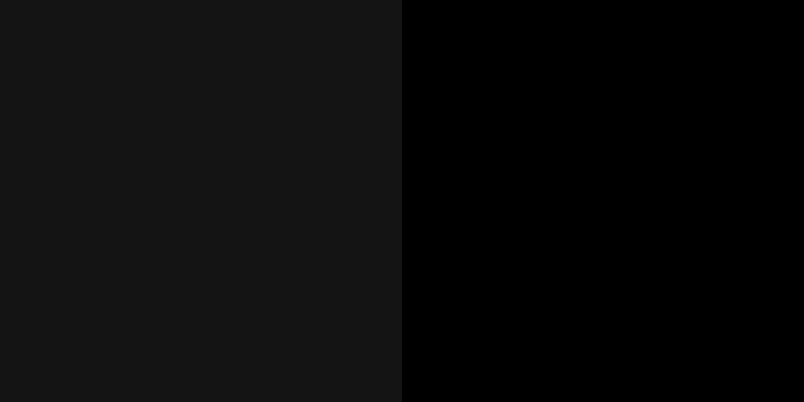
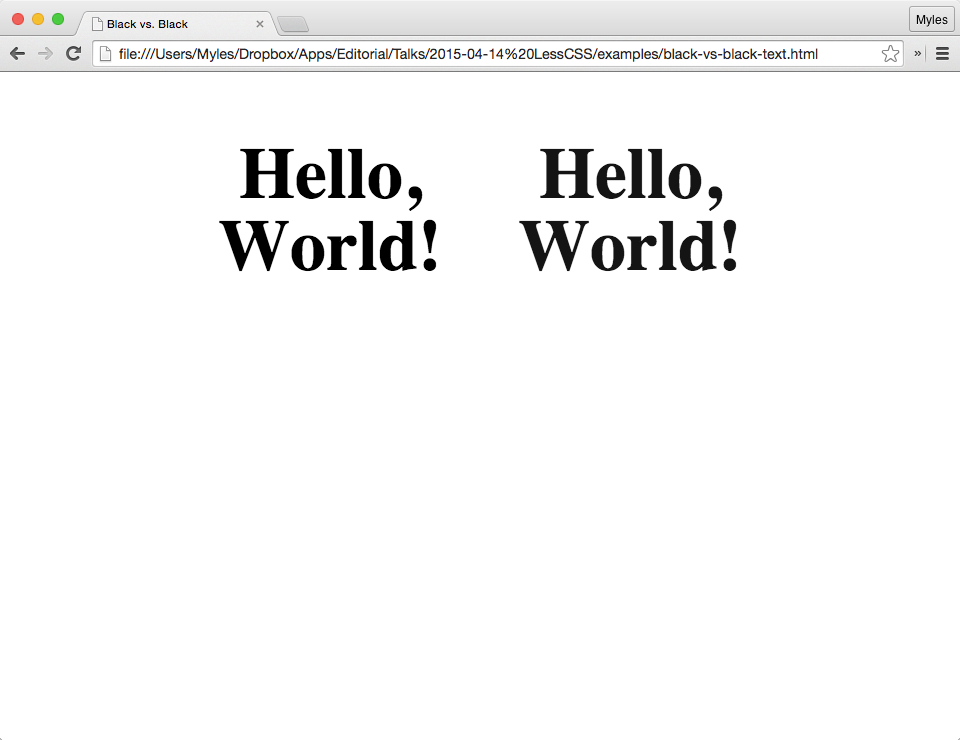
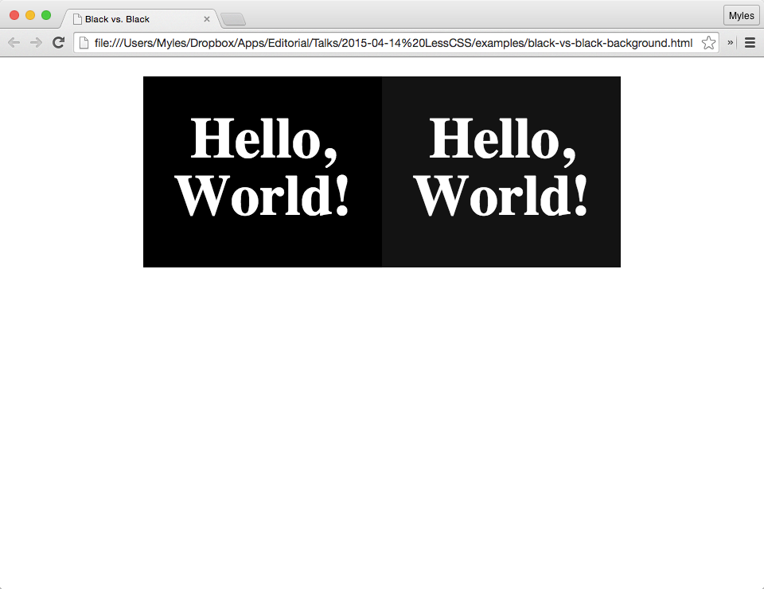
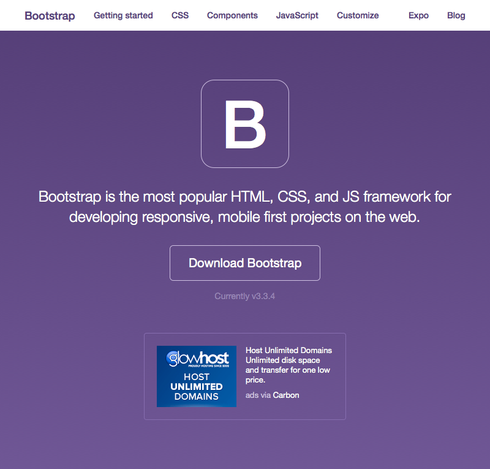
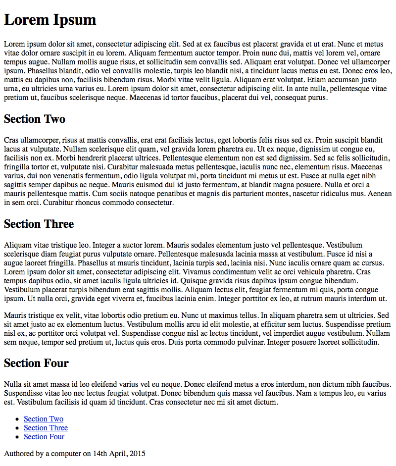
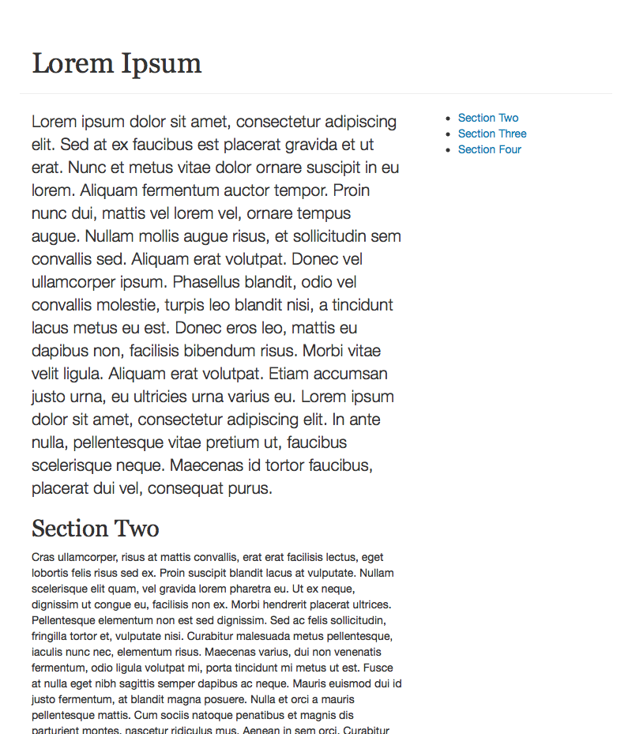
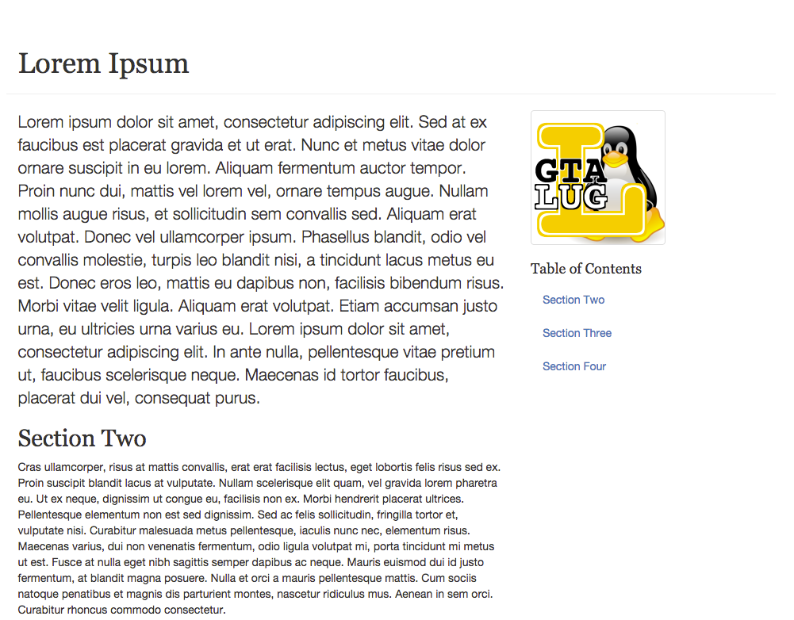
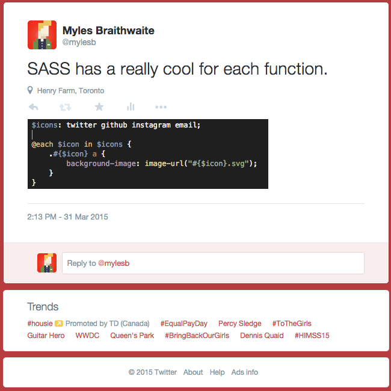

# [fit] LessCSS

# [fit] Myles Braithwaite

# [fit] [http://myles.coffee](http://myles.coffee) | [me@myles.coffee](https://www.twitter.com/mylesb) | [@MylesB](https://twitter.com/mylesb)

---



> Behind every beautiful thing, there's some kind of pain.
-- Bob Dylan

---

# [fit] What is LessCSS?

^ Less is a CSS pre-processor written in JavaScript (with a bunch of ports in other languages).

^ It extends the CSS language and adds addtional features (variables, mixins, and functions).

^ This allows you to make your CSS more maintainable, themeable, and extendable.

---

# [fit] Why?

^ So you are probably asking your self why should I use JavaScript to make CSS better... While...

---

# [fit] Ask anyone

# [fit] CSS Sucks!

^ Now slap anyone who agrees with this statment. Because...

---

# [fit] Not Really

# [fit] But it's hard.

^ CSS doesn't necessarily suck it just really hard to do right.

---

```html
<h1 style="font-family:Helvetica;font-size:2em;font-weight:normal;">
	<span style="font-weight:bold;">Myles</span>
	<span style="display:none;">Alden</span>
	<span>Braithwaite</span>
</h1>
```

^ People tend to write CSS like this.

---

# [fit] How?

^ LessCSS helps by adding a bunch of features that should have probably already existed in CSS.

---

# Variables

```css
@black: #141414;

p {
	color: @black;
}
```

^ CSS currently doesn't support variables which makes things really difficult when you are working with a lot of colours and sizes.

^ If you will notice I'm not using absolute black.

---

# Tangent

# [Design Tip: Never Use Black](http://ianstormtaylor.com/design-tip-never-use-black/) by *Ian Storm Taylor*.

^ This is because absolute black doesn't exist in nature.

---



^ Let's take this photograph of a black cat (shot by Simon Law).

^ If we search for the darkest colour in the photograph we get...

---



^ the shade of black on the left and comparing that to absolute black we get quite a difference.

---



<http://myles.github.io/2015-04-14-lesscss/black-vs-black-web-site-text.html>

^ Here is a sample of text output. The text on the right is much more readable than the text on the left.

---



<http://myles.github.io/2015-04-14-lesscss/black-vs-black-web-site-background.html>

^ We see the same thing here when we use it as a backgrou.d

---

# Built in Functions

```css
@blue: rgb(0, 161, 226);
@dark-blue: darken(@blue, 10%);
@light-blue: lighten(@blue, 10%);

a {
	color: @blue;
	text-decoration: none;
	border-bottom: 1px solid @dark-blue;
	&:hover {
		color: @dark-blue;
		border-bottom-color: @blue;
	}
	&:active {
		color: @light-blue;
		border-bottom-color: @dark-blue;
	}
}
```

^ Less provides some amazing functions.

---

# Fuctions

- **Miscellaneous**: `color`, `image-size`, `image-width`, `image-height`, `convert`, `data-uri`, `default`, `unit`, `get-unit`, and `svg-gradient`.
- **String**: `escape`, `e`, `%` format, and `replace`.
- **List**: `length` and `extract`.
- **Type**: `isnumber`, `isstring`, `iscolor`, `iskeyword`, `isurl`, `ispixel`, `isem`, `ispercentage`, `isunix`, and `isruleset`.

^ A couple cool fuctions on this list are `image-*` and `data-uri`.

^ The `image-size` is really good for building your custom Mixins for Hero Units.

^ And the `data-uri` is really good for when you want to include an image file in your CSS.

^ `svg-gradient` will create a great gradient background in a SVG.

---

# Functions _Math_

- **Math**: `ceil`, `floor`, `percentage`, `round`, `sqrt`, `abs`, `sin`, `asin`, `cos`, `acos`, `tan`, `atan`, `pi`, `pow`, `mod`, `min`, and `max`.

^ The math functions are useful for doing your layouts.

^ Warning you are using JavaScript's Math class.

---

# Fuctions _Colour_

- **Colour Definition**: `rgb`, `rgba`, `argb`, `hsl`, `hsla`, `hsv`, and `hsva`.
- **Colour Channel**: `hue`, `saturation`, `lightness`, `hsvhue`, `hsvsaturation`, `hsvvaule`, `red`, `green`, `blue`, `alpha`, `luma`, and `luminance`.

^ Most of these function return information about a given colour.

---

# Fuctions _Colour_ (continuted)

- **Color Operation**: `saturate`, `desaturate`, `lighten`, `darken`, `fadein`, `Colour`, `fade`, `spin`, `mix`, `greyscale`, and `contrast`.
- **Colour Blending**: `multiply`, `screen`, `overlay`, `softlight`, `hardlight`, `difference`, `exclusion`, `average`, and `negation`.

---

# Loops

```css
.make-columns(4);

.make-columns(@n, @i: 1) when (@i =< @n) {
	.column-@{i} {
		width: (@i * 100% / @n);
	}
	.generate-columns(@n, (@i + 1));
}
```

## Outputs

```css
.column-1 { width: 25%; }
.column-2 { width: 50%; }
.column-3 { width: 75%; }
.column-4 { width: 100%; }
```

^ Loops are really useful when you need to make a bunch of repeating CSS elements.

---

# Mixins

```css
.min-resolution(@size) {
	-webkit-min-device-pixel-ratio: @size;
	-moz-device-pixel-ratio: @size;
	min-resolution: @size;
}

.2x(@path, @w: auto, @h: auto) {
	background-image: url(@path);
	@2x_path: ~`@{path}.replace(/\.\w+$/, function(match) { return "@2x" + match; })`;
	@media (.min-resolution(1.5px)) {
		background-image: url("@{2x_path}");
		background-size: @w @h;
	}
}
```

---

# Extend

```css
article.pretty {
	header {
		h1 {
			font-family: 'Sanchez', @serif-family;
		}
	}
	section, footer {
		font-family: 'Questrial', @sans-serif-family;
	}
	section {
		color: @dark-gray;
	}
	footer {
		color: @gray;
	}
}
```

---



# [fit] Extend Your Website With

# [fit] BootstrapCSS

- Font-end Framework for web sites.

- <http://getbootstrap.com/>

^ One of the great use cases for LessCSS is the usage with a front-end framework like Bootstrap.

^ It provides a bunch of useful UI components like buttons, responsive layouts, typography, forms, navigation, and many more.

---



# `article.html`

```html
<main>
	<article>
		<header>
			<h1>Article Title</h1>
		</header>
		<section>
			<!-- the body of the article -->
		</section>
		<aside>
			<!-- table of contents -->
		</aside>
		<footer>
			<!-- author, published date, copyright -->
		</footer>
	</article>
</main>
```

---


# `_layout.less`

```css
/* _layout.less START */
main {
	.container();
}
article {
	.make-row();
}
header, footer {
	.make-xs-column(12);
}

section {
	.make-sm-column(8);
}

aside {
	.make-sm-column(4);
	.hidden-xs();
}
/* _layout.less END */
```

---



# `_typography.less`

```css
/* _typography.less START */
@font-family-base: 'Questrial', @font-family-sans-serif;
@headings-font-family: 'Sanchez', @font-family-serif;

article {
  header {
    .page-header();
  }
  
  section {
    p {
      &:first-of-type { .lead(); }
    }
  }
  
  footer {
    padding-top: ((@line-height-computed / 2) - 1);
    margin: (@line-height-computed * 2) 0 @line-height-computed;
    border-top: 1px solid @page-header-border-color;
  }
}
/* _typography.less END */
```

---


# `_aside.less`

```css
/* _aside.less START */
article {
  aside {
    position: relative;
    
    .inner {
      position: fixed;
    }
    
    ul {
      .nav();
      .nav-pills();
      .nav-stacked();
    }
  }
}
/* _aside.less END */
```

---



# `_logo.less`

```css
/* _logo.less START */
aside {
  .logo {
    .text-hide();
    .thumbnail();
    
    width: 170px;
    height: 170px;
    
    background-image: url('gtalug.png');
  }
}
/* _logo.less END */
```

---

# `style.less`

```css
@import "bt/bootstrap.less";

@import "_layout.less";
@import "_typography.less";
@import "_aside.less";
@import "_logo.less";
```

---

# `style.css`

```css
/* _layout.less START */
main { margin-right: auto; margin-left: auto; padding-left: 15px; padding-right: 15px; }
@media (min-width: 768px) {
  main { width: 750px; }
}
@media (min-width: 992px) {
  main { width: 970px; }
}
@media (min-width: 1200px) {
  main { width: 1170px; }
}
main > .navbar-header, main > .navbar-collapse { margin-right: -15px; margin-left: -15px; }
@media (min-width: 768px) {
  main > .navbar-header, main > .navbar-collapse { margin-right: 0; margin-left: 0; }
}
article { margin-left: -15px; margin-right: -15px; }
header, footer { position: relative; float: left; width: 100%; min-height: 1px; padding-left: 15px; padding-right: 15px; }
section { position: relative; min-height: 1px; padding-left: 15px; padding-right: 15px; }
@media (min-width: 768px) {
  section { float: left; width: 66.66666667%; }
}
aside { position: relative; min-height: 1px; padding-left: 15px; padding-right: 15px; }
@media (min-width: 768px) {
  aside { float: left; width: 33.33333333%; }
}
@media (max-width: 767px) {
  aside { display: none !important; }
}
/* _layout.less END */
```

---

# `style.css`

```
/* _typography.less START */
article header { padding-bottom: 9px; margin: 40px 0 20px; border-bottom: 1px solid #eeeeee; }
article section p:first-of-type { margin-bottom: 20px; font-size: 16px; font-weight: 300; line-height: 1.4; }
@media (min-width: 768px) {
  article section p:first-of-type { font-size: 21px; }
}
article footer { padding-top: 9px; margin: 40px 0 20px; border-top: 1px solid #eeeeee; }
/* _typography.less END */
```

---

# `style.css`

```css
/* _aside.less START */
article aside { position: relative; }
article aside .inner { position: fixed; }
article aside ul { margin-bottom: 0; padding-left: 0; list-style: none; }
article aside ul > li { position: relative; display: block; }
article aside ul > li > a { position: relative; display: block; padding: 10px 15px; }
article aside ul > li > a:hover, article aside ul > li > a:focus { text-decoration: none; background-color: #eeeeee; }
article aside ul > li.disabled > a { color: #777777; }
article aside ul > li.disabled > a:hover, article aside ul > li.disabled > a:focus {
	color: #777777; text-decoration: none; background-color: transparent; cursor: not-allowed; }
article aside ul .open > a, article aside ul .open > a:hover, article aside ul .open > a:focus {
	background-color: #eeeeee; border-color: #337ab7; }
article aside ul .nav-divider { height: 1px; margin: 9px 0; overflow: hidden; background-color: #e5e5e5; }
article aside ul > li > a > img { max-width: none; }
article aside ul > li { float: left; }
article aside ul > li > a { border-radius: 4px; }
article aside ul > li + li { margin-left: 2px; }
article aside ul > li.active > a, article aside ul > li.active > a:hover, article aside ul > li.active > a:focus {
	color: #ffffff; background-color: #337ab7; }
article aside ul > li { float: none; }
article aside ul > li + li { margin-top: 2px; margin-left: 0; }
/* _aside.less END */
```

---

# `style.css`

```css
/* _logo.less START */
aside .logo { font: 0/0 a; color: transparent; text-shadow: none;
	background-color: transparent; border: 0; display: block; padding: 4px;
	margin-bottom: 20px; line-height: 1.42857143; background-color: #ffffff;
	border: 1px solid #dddddd; border-radius: 4px;
	-webkit-transition: border 0.2s ease-in-out;
	-o-transition: border 0.2s ease-in-out;
	transition: border 0.2s ease-in-out; width: 170px;
	height: 170px; background-image: url('gtalug.png'); }
aside .logo > img, aside .logo a > img { margin-left: auto; margin-right: auto; }
aaside .logo:hover, aaside .logo:focus, aaside .logo.active { border-color: #337ab7; }
aside .logo .caption { padding: 9px; color: #333333; }
/* _logo.less END */
```

^ Anyone see the problem with this code.

---

```bash
$ wc *.less
      16      27     218 _aside.less
      19      30     219 _layout.less
      12      22     191 _logo.less
      21      50     470 _typography.less
       5      10     126 style.less
      73     139    1224 total

$ lessc --clean-css style.less | wc
       0    1496  119568
```

^ I'm using the [less-plugin-clean-css](https://github.com/less/less-plugin-clean-css) to extract all the comments, newlines, and spaces in the file.

---

```bash
$ uncss http://127.0.0.1:8000/article.html > style.css
$ wc style.css 
     370     606    5426 style.css
$ yuicompressor style.css -o style.min.css 
$ wc style.min.css 
       0      86    4348 style.min.css
```

^ Just for fun let's run [uncss](https://github.com/giakki/uncss), which will remove all the unnecessary CSS elements, then run [YUI Compressor](https://yui.github.io/yuicompressor/) to shrink the file.

---

# Installation/Usage

# Command Line

- `npm install -g lessc`
- `lessc style.less > style.css`

# Client-side usage

```html
<link rel="stylesheet/less" type="text/css" href="styles.less">

<script src="less.js" type="text/javascript"></script>
```

---

# [fit] Sass

# [fit] Syntactically Awesome Style Sheets

^ Sass is another CSS procesor.

^ It's much more complicated than LessCSS.

^ But has a large feature set and much more programmer friendly.

^ Heavely integrated with Rails.

---

# Variables

## Sass 

```css
$color: #141414;

p {
	color: $color;
}
```

## Less

```css
@color: #141414;

p {
	color: @color;
}
```

---

# Nesting

## Sass and Less

```css
a {
	color: red;
	&:hover {
		color: blue;
	}
}
```

---

# Mixins

## Sass

```css
@mixin bordered {
	border-top: dotted 1px black;
	border-bottom: solid 2px black; }

span { @include bordered; }
```

## Less

```css
.bordered {
	border-top: dotted 1px black;
	border-bottom: solid 2px black; }

span { .bordered(); }
```

---

# Selector Inheritance _Sass Only_

```css
.bordered { border: 1px solid black; }

span.one { @extend .bordered; color: blue; }

span.two { @extend .bordered; color: red; }
```

## Output

```css
.bordered, span.one, span.two { border: 1px solid black; }

span.one { color: blue; }

span.two { color: red; }
```

---



---

# [fit] Sass is pretty cool

# [fit] And is worth it's own talk

---

# [fit] Questions

---

# Contact Me

- Web: <http://myles.coffee/>
- Email: <me@myles.coffee>
- Twitter: [@MylesB](https://www.twitter.com/mylesb)

---

# Attributions

- [Black Cat](https://www.flickr.com/photos/sfllaw/19510514/) photographed by _Simon Law_.